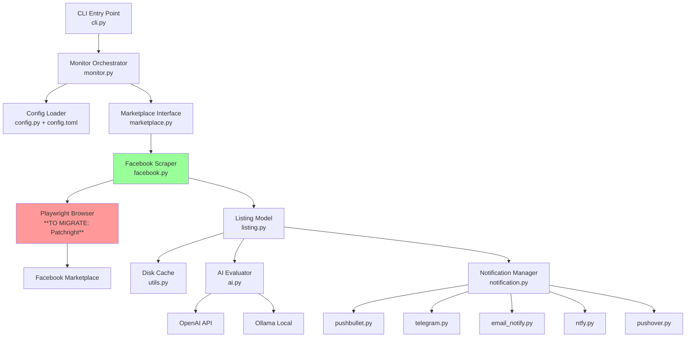
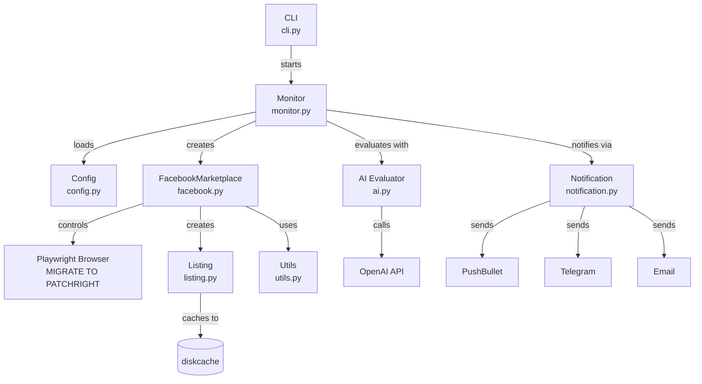

# ai-marketplace-monitor Architecture Analysis

## Introduction

This document provides a comprehensive analysis of the ai-marketplace-monitor architecture as it currently exists. It serves as a reference for understanding the system structure, technology choices, and implementation patterns to inform the NZ car scraper enhancement.

**Document Purpose:**
- Understand existing codebase architecture
- Identify current patterns and conventions
- Document technology stack and infrastructure
- Create foundation for enhancement planning (Playwright → Patchright migration + NZ car scraping features)

### Analysis Scope

- **Project Root:** `/Users/nomadbitcoin/Projects/coding-sessions/browsing/facebook/ai-marketplace-monitor`
- **Analysis Date:** 2026-03-01
- **Documentation Reviewed:** README.md, pyproject.toml, source code (facebook.py, monitor.py, config.py, config.toml), tests
- **Scope:** Complete codebase analysis focusing on Facebook Marketplace automation capabilities, browser automation patterns, configuration system, and extensibility points

### Change Log

| Change | Date | Version | Description | Author |
|--------|------|---------|-------------|---------|
| Initial analysis | 2026-03-01 | 1.0 | Brownfield architecture analysis for NZ car scraper enhancement | BMad Rapid |

---

## Project Overview

### Project Purpose

**Primary Purpose:** AI-powered monitoring tool for Facebook Marketplace listings with intelligent notifications

**Target Audience:** Individual users searching for specific items on Facebook Marketplace (primarily US market currently)

**Current State:** Production-ready open-source project (v0.9.11), actively maintained with comprehensive test coverage and documentation

### Key Features

- **Multi-marketplace search** with configurable regions (USA, Canada, Mexico, Brazil, Argentina, Australia, NZ, India, UK, France, Spain)
- **AI-powered listing evaluation** using OpenAI, DeepSeek, or self-hosted Ollama
- **Multiple notification channels** (PushBullet, PushOver, Telegram, Ntfy, Email)
- **Advanced filtering** with keyword boolean logic, price ranges, seller location filtering, condition filters
- **Intelligent caching** with diskcache to avoid re-processing listings
- **Multi-city and region search** with radius configuration
- **Keyword filtering** with antikeywords support
- **Session persistence** to maintain Facebook authentication
- **Translation support** for non-English locales (Spanish, Chinese, Swedish)
- **CI/CD pipeline** with GitHub Actions, automated testing, code quality checks

---

## Technology Stack

### Runtime Platform

- **Language:** Python (3.10+)
- **Runtime:** CPython
- **Package Manager:** uv (modern Python package manager), pip (legacy)

### Frameworks & Libraries

| Category | Technology | Version | Purpose |
|----------|-----------|---------|---------|
| CLI Framework | Typer | >=0.15.1 | Command-line interface with rich help |
| Browser Automation | Playwright | >=1.41.0 | **[MIGRATION TARGET]** Web automation (to be replaced with Patchright) |
| AI Integration | OpenAI SDK | >=1.24.0 | AI-powered listing evaluation |
| Notifications | pushbullet.py | >=0.12.0 | Push notifications |
| Notifications | python-telegram-bot | >=22.3 | Telegram notifications |
| Caching | diskcache | >=5.6.3 | Persistent listing cache |
| File Watching | watchdog | >=4.0.0 | Config file hot-reloading |
| Scheduling | schedule | >=1.2.2 | Periodic search scheduling |
| Currency | CurrencyConverter | >=0.18.0 | Multi-currency price handling |
| Date Parsing | parsedatetime | >=2.5 | Natural language date parsing |
| Templating | Jinja2 | >=3.0.0 | Email notification templates |
| HTTP Client | requests | >=2.30.0 | External API calls |
| Image Processing | Pillow | >=10.0.0 | Image handling for notifications |

### Development Tools

- **Testing:** pytest (>=8.3.3) with pytest-playwright, pytest-cov, xdoctest
- **Linting:** ruff (>=0.9.2), isort (>=5.13.2), black (>=24.10)
- **Type Checking:** mypy (>=1.13.0)
- **Security:** safety (>=3.5.2), pip-audit (>=2.9.0)
- **Code Quality:** pre-commit hooks with automated checks
- **Coverage:** coverage[toml] (>=7.6.7) with 100% target

### Infrastructure & DevOps

- **CI/CD:** GitHub Actions with matrix testing (Python 3.10, 3.11, 3.12)
- **Documentation:** Sphinx with ReadTheDocs hosting
- **Build System:** hatchling (PEP 621 compliant)
- **Dependency Management:** dependabot for automated updates
- **Security Scanning:** CodeQL analysis, safety checks in CI

---

## Architecture Overview

### Architecture Style

**Style:** Monolithic CLI Application

**Pattern:** Event-driven monitoring with scheduled tasks

**Description:** Single-process Python application that orchestrates browser automation, AI evaluation, and multi-channel notifications. Uses Playwright for browser control, diskcache for persistence, and a pluggable notification system. Configuration-driven architecture with TOML files defining search tasks.

### High-Level Architecture Diagram



**Note:** Red box indicates migration target (Playwright → Patchright for stealth)

---

## Source Code Organization

### Directory Structure

```plaintext
ai-marketplace-monitor/
├── src/
│   └── ai_marketplace_monitor/          # Main package
│       ├── __init__.py                   # Package initialization
│       ├── cli.py                        # Typer CLI entry point
│       ├── monitor.py                    # Orchestration logic
│       ├── config.py                     # Config parsing & validation
│       ├── config.toml                   # Default config with region defs
│       ├── marketplace.py                # Abstract Marketplace interface
│       ├── facebook.py                   # **CORE**: FB automation logic
│       ├── listing.py                    # Listing data model
│       ├── ai.py                         # AI evaluation logic
│       ├── notification.py               # Notification orchestration
│       ├── pushbullet.py                 # PushBullet integration
│       ├── telegram.py                   # Telegram integration
│       ├── email_notify.py               # Email notifications
│       ├── ntfy.py                       # Ntfy integration
│       ├── pushover.py                   # Pushover integration
│       ├── region.py                     # Region data structures
│       ├── user.py                       # User config model
│       └── utils.py                      # Caching, keyboard monitor, utils
├── tests/                                # Pytest test suite
│   ├── test_facebook.py                  # **KEY**: FB scraper tests
│   ├── test_facebook_keyword_filtering.py
│   ├── test_ai.py
│   ├── test_cli.py
│   ├── test_notification.py
│   └── test_utils.py
├── docs/                                 # Sphinx documentation
│   ├── conf.py                           # Sphinx config
│   ├── example_config.toml               # Example configs
│   ├── minimal_config.toml
│   └── *.md                              # User docs
├── .github/                              # CI/CD workflows
│   └── workflows/
│       ├── tests.yml                     # Pytest on matrix
│       ├── release.yml                   # PyPI publishing
│       ├── codeql-analysis.yml           # Security scanning
│       └── pre-commit-autoupdate.yml
├── pyproject.toml                        # Python project config
├── uv.lock                               # Dependency lock file
├── conftest.py                           # Pytest configuration
└── noxfile.py                            # Task automation
```

### Organization Patterns

**File Naming:** Lowercase with underscores (snake_case)

**Module Organization:** Flat structure within `src/ai_marketplace_monitor/` - single responsibility modules (one module per marketplace, one per notification channel)

**Code Grouping:** Feature-based modules (facebook.py contains all FB logic), with shared utilities in utils.py

---

## Data Architecture

### Database Overview

- **Database Type:** NoSQL (Key-Value Store)
- **Specific Technology:** diskcache (Python library providing disk-based cache with SQLite backend)
- **Version:** >=5.6.3
- **Deployment Model:** Embedded (local file-based cache directory)
- **ORM/Query Tool:** diskcache API (dict-like interface)
- **Schema Management:** N/A (schema-less key-value store)
- **Migration Tool:** N/A (no schema migrations needed)

### Read Operations Architecture

**Primary Read Patterns:**
- **Listing cache lookups** by post_url (deduplication check)
- **AI evaluation cache** by listing content hash

**Query Complexity:**
- **Simple Queries:** Direct key-value lookups by URL or hash
- **Complex Queries:** None (no joins or aggregations)

**Indexing Strategy:**
- Default diskcache indexing on keys (URL strings)

**Read Optimization:**
- **Caching:** Entire system is cache-based (listings stored indefinitely to avoid re-processing)
- **Query Optimization:** O(1) lookups by key
- **Read Scaling:** Single-process, local disk I/O

**Common Read Operations:**
- `Listing.from_cache(post_url)` - Check if listing already processed
- Cache lookup for AI evaluations to avoid redundant API calls

### Write Operations Architecture

**Primary Write Patterns:**
- **Insert-only** for new listings (listings never updated once cached)
- **AI evaluation results** cached after each API call

**Write Operations:**
- **Inserts:** New listing saved with `to_cache(post_url)`
- **Updates:** N/A (cache entries are immutable)
- **Deletes:** Manual cache clearing only (no automatic expiration)
- **Bulk Operations:** None (single-listing writes)

**Transaction Handling:**
- **Transaction Support:** No ACID transactions (simple write-through)
- **Isolation Level:** N/A
- **Consistency Guarantees:** Eventual consistency (disk writes)

**Write Optimization:**
- **Batching:** No batching (immediate writes)
- **Async Writes:** Synchronous writes
- **Write Scaling:** Single-process, local disk I/O

**Data Validation:**
- **Application-level:** Listing model validates required fields (title, price, url)
- **Database-level:** None (schema-less)

### Data Access Patterns

**Data Access Pattern:** Direct cache access (no repository pattern)

**Connection Management:**
- **Connection Pooling:** N/A (embedded cache)
- **Pool Size:** N/A

**Query Construction:**
- **ORM Usage:** 0% (diskcache provides dict-like API)
- **Query Builder:** 0%
- **Raw SQL:** 0% (diskcache abstracts SQLite backend)

**Abstraction Layers:**
- `Listing.from_cache()` and `Listing.to_cache()` static methods provide thin abstraction over diskcache

### Data Models

#### Listing Model

**Purpose:** Represents a single Facebook Marketplace listing with metadata

**Storage:** diskcache keyed by `post_url`

**Key Attributes:**
- `id`: Listing ID extracted from URL
- `title`: Listing title
- `price`: Extracted price (normalized)
- `location`: Seller location string
- `seller`: Seller name
- `description`: Full listing description
- `image`: Primary image URL
- `post_url`: Facebook listing URL (unique key)
- `condition`: Item condition (new/used_like_new/used_good/used_fair)
- `marketplace`: Marketplace name ("facebook")
- `name`: Item config name (for tracking)

**Relationships:**
- None (flat data model)

**Indexes:**
- Implicit index on `post_url` (cache key)

#### ItemConfig Model

**Purpose:** Configuration for a single search item

**Storage:** Parsed from TOML config file (not persisted to cache)

**Key Attributes:**
- `search_phrases`: List of search terms
- `keywords`: Boolean logic for filtering
- `antikeywords`: Exclusion keywords
- `min_price`, `max_price`: Price range
- `seller_locations`: Allowed seller locations
- `search_city`, `radius`: Geographic search parameters
- `searched_count`: Track search iterations

**Relationships:**
- References `MarketplaceConfig` for defaults
- References `User` config for notifications

### Database Performance Characteristics

**Read Performance:**
- **Typical Read Latency:** <1ms (disk-based lookup)
- **Read Throughput:** ~1000s reads/sec (limited by disk I/O)

**Write Performance:**
- **Typical Write Latency:** <10ms (synchronous disk write)
- **Write Throughput:** ~100s writes/sec

**Performance Bottlenecks:**
- Disk I/O for large caches (100,000+ listings)
- No cache eviction strategy (grows indefinitely)

**Monitoring:**
- No built-in monitoring (could add cache size logging)

### Data Flow

1. **Search Execution:** Monitor orchestrates search via `FacebookMarketplace.search(item_config)`
2. **Listing Discovery:** Browser scrapes search results page, extracts listing URLs
3. **Cache Check:** For each URL, `Listing.from_cache(post_url)` checks if already processed
4. **Detail Fetch:** If not cached, navigate to listing page and parse details
5. **Cache Write:** `Listing.to_cache(post_url)` saves listing to diskcache
6. **AI Evaluation:** If AI enabled, evaluate listing (result also cached)
7. **Notification:** Matching listings sent via notification channels

---

## Component Architecture

### Major Components

#### CLI Entry Point (`cli.py`)

**Location:** `src/ai_marketplace_monitor/cli.py`

**Responsibility:** Typer-based CLI interface for starting monitor, managing config, manual searches

**Key Files:**
- `cli.py` (main CLI app)

**Dependencies:**
- `monitor.py` (MarketplaceMonitor)
- `config.py` (Config loader)
- Typer, Rich

**Used By:**
- End users via `ai-marketplace-monitor` or `aimm` command

#### Monitor Orchestrator (`monitor.py`)

**Location:** `src/ai_marketplace_monitor/monitor.py`

**Responsibility:** Orchestrates search scheduling, marketplace coordination, notification dispatch

**Key Files:**
- `monitor.py` (MarketplaceMonitor class)

**Dependencies:**
- `marketplace.py` (Marketplace interface)
- `facebook.py` (FacebookMarketplace)
- `config.py` (Config)
- `notification.py` (notify function)
- `schedule` library

**Used By:**
- `cli.py` (main entry point)

#### Facebook Scraper (`facebook.py`) **[MIGRATION TARGET]**

**Location:** `src/ai_marketplace_monitor/facebook.py`

**Responsibility:** **CORE COMPONENT** - Facebook Marketplace automation with Playwright, search result parsing, listing detail extraction

**Key Files:**
- `facebook.py` (1,176 lines - FacebookMarketplace, FacebookSearchResultPage, FacebookItemPage variants)

**Dependencies:**
- **Playwright** (playwright.sync_api) **← TO BE REPLACED WITH PATCHRIGHT**
- `marketplace.py` (Marketplace base class)
- `listing.py` (Listing model)
- `utils.py` (extract_price, is_substring, etc.)
- `CurrencyConverter`

**Used By:**
- `monitor.py` (MarketplaceMonitor)

**Critical for NZ Car Scraper:**
- ✅ Already has keyword filtering (`check_listing` method)
- ✅ Already has seller location filtering
- ✅ Already has multi-city search support
- ✅ Already has radius configuration
- ✅ Already has category support (Category.VEHICLES enum exists!)
- ❌ Uses standard Playwright (needs Patchright migration)
- ❌ No WOF/Rego-specific filtering (can extend keyword filtering)
- ❌ No CSV export (listings only stored in cache)
- ❌ No seller profile URL extraction

#### Configuration System (`config.py` + `config.toml`)

**Location:** `src/ai_marketplace_monitor/config.py`, `config.toml`

**Responsibility:** TOML config parsing, validation, region definitions, marketplace/item config objects

**Key Files:**
- `config.py` (Config dataclasses, validation logic)
- `config.toml` (default regions: usa, can, mex, bra, arg, aus, nzl, ind, gbr, fra, spa)

**Dependencies:**
- `tomli` (Python <3.11) or `tomllib` (Python 3.11+)
- `dataclasses`

**Used By:**
- All components (config is central)

**NZ Region Already Defined:**
```toml
[region.nzl]
full_name = "New Zealand"
radius = 805
city_name = ["Hamilton", "Lake Tekapo"]
search_city = ["104080336295923", "106528236047934"]
currency = 'NZD'
```
**Note:** Only 2 cities defined, need to add Auckland, Rotorua, Napier, Wellington

#### Listing Data Model (`listing.py`)

**Location:** `src/ai_marketplace_monitor/listing.py`

**Responsibility:** Listing dataclass, caching logic, serialization

**Key Files:**
- `listing.py`

**Dependencies:**
- `utils.py` (cache access)
- `dataclasses`

**Used By:**
- `facebook.py` (creates listings)
- `monitor.py` (processes listings)
- `notification.py` (formats notifications)

#### AI Evaluator (`ai.py`)

**Location:** `src/ai_marketplace_monitor/ai.py`

**Responsibility:** AI-powered listing evaluation via OpenAI/DeepSeek/Ollama

**Key Files:**
- `ai.py`

**Dependencies:**
- `openai` SDK
- `utils.py` (caching)

**Used By:**
- `monitor.py` (optional AI evaluation)

#### Notification Manager (`notification.py`)

**Location:** `src/ai_marketplace_monitor/notification.py`

**Responsibility:** Multi-channel notification dispatch, message formatting

**Key Files:**
- `notification.py` (orchestration)
- `pushbullet.py`, `telegram.py`, `email_notify.py`, `ntfy.py`, `pushover.py`

**Dependencies:**
- Channel-specific SDKs (pushbullet.py, python-telegram-bot, etc.)
- `jinja2` (email templates)

**Used By:**
- `monitor.py` (sends notifications for matching listings)

### Component Interaction Diagram



---

## External Integrations

### OpenAI API

- **Purpose:** AI-powered listing evaluation and recommendations
- **Type:** REST API (synchronous calls via openai SDK)
- **Documentation:** https://platform.openai.com/docs
- **Authentication:** API key in config
- **Implementation Location:** `src/ai_marketplace_monitor/ai.py`

### PushBullet API

- **Purpose:** Push notifications to mobile/desktop
- **Type:** REST API (via pushbullet.py SDK)
- **Documentation:** https://docs.pushbullet.com/
- **Authentication:** API token in user config
- **Implementation Location:** `src/ai_marketplace_monitor/pushbullet.py`

### Telegram Bot API

- **Purpose:** Telegram notifications
- **Type:** REST API (via python-telegram-bot SDK)
- **Documentation:** https://core.telegram.org/bots/api
- **Authentication:** Bot token + chat ID in user config
- **Implementation Location:** `src/ai_marketplace_monitor/telegram.py`

### Facebook Marketplace (Web Scraping)

- **Purpose:** **PRIMARY INTEGRATION** - Search and listing data extraction
- **Type:** Browser automation (Playwright navigating facebook.com/marketplace)
- **Documentation:** N/A (reverse-engineered)
- **Authentication:** Manual login with session persistence (username/password optional, 2FA handled manually)
- **Implementation Location:** `src/ai_marketplace_monitor/facebook.py`
- **⚠️ CRITICAL:** Uses Playwright (easily detected by Facebook) - **MUST MIGRATE TO PATCHRIGHT**

---

## Infrastructure & Deployment

### Hosting & Infrastructure

**Platform:** User-deployed (local machines or VPS)

**Infrastructure Tools:** None (no IaC - simple Python package installation)

**Environment Variables:** Not used (configuration via `~/.ai-marketplace-monitor/config.toml`)

### Environments

- **Local Development:** Developer machines with headed browser for testing
- **Production:** User machines running scheduled searches (headless or headed Playwright)
- **CI:** GitHub Actions runners for automated testing

### Deployment Process

**Process:** PyPI package distribution

**CI/CD Tool:** GitHub Actions

**Deployment Frequency:** Release-based (bump version → GitHub release → PyPI publish)

**Installation:**
```bash
pip install ai-marketplace-monitor
playwright install  # Install browser binaries
```

---

## Coding Standards & Conventions

### Code Style

**Style Guide:** Google Python Style Guide (enforced via ruff pydocstyle)

**Linting:**
- `ruff` (>=0.9.2) - Fast Python linter
- `isort` (>=5.13.2) - Import sorting
- `black` (>=24.10) - Code formatting

**Formatting:** Black with 99-character line length

### Testing Patterns

**Test Framework:** pytest (>=8.3.3)

**Test Organization:**
- Tests mirror `src/` structure in `tests/` directory
- `test_facebook.py` contains Facebook-specific tests
- `test_facebook_keyword_filtering.py` focuses on keyword logic
- Integration tests use pytest-playwright for browser testing

**Coverage:** Enforced 100% coverage target (via coverage.py with `fail_under = 100`)

**Key Test Files:**
- `tests/test_facebook.py` - **CRITICAL** for validating FB scraper
- `tests/test_facebook_keyword_filtering.py` - Keyword/antikeyword logic
- `conftest.py` - Shared pytest fixtures

### Documentation Style

**Code Comments:** Google-style docstrings for functions/classes

**API Documentation:** Sphinx-generated docs hosted on ReadTheDocs (https://ai-marketplace-monitor.readthedocs.io)

**README Structure:** Comprehensive README with Quick Start, Features, Configuration examples

---

## Security Implementation

### Authentication & Authorization

**Authentication:**
- Facebook login via Playwright (manual or username/password)
- Session persistence via Playwright's `browser_context.storage_state()`

**Authorization:** N/A (single-user application)

**Session Management:** Persistent browser context stored to disk, reused across runs

### Data Protection

**Encryption:** None (local data storage only)

**Secrets Management:**
- API keys stored in TOML config files (user responsibility to protect)
- Config files gitignored by default (`~/.ai-marketplace-monitor/`)

**Sensitive Data Handling:**
- Facebook credentials (if provided) stored in plaintext in config
- Recommendation: Use manual login to avoid storing password

### Security Tools

- **safety** (>=3.5.2): Check dependencies for known vulnerabilities
- **pip-audit** (>=2.9.0): Audit installed packages for security issues
- **CodeQL:** GitHub automated security analysis

---

## Performance Patterns

### Caching Strategy

**Caching Tools:** diskcache (>=5.6.3)

**Cache Locations:**
- Listing cache: `~/.ai-marketplace-monitor/cache/` (listings keyed by URL)
- AI evaluation cache: Keyed by listing content hash

**Cache Strategy:**
- **Never evict:** Listings cached indefinitely (prevents re-processing)
- **Deduplication:** Check cache before fetching listing details

### Optimization Patterns

- **Lazy browser initialization:** Only launch Playwright when first search executes
- **Session reuse:** Persistent browser context avoids repeated logins
- **Selective detail fetching:** Only fetch listing details if not in cache
- **AI caching:** Cache AI evaluations to avoid redundant API calls (cost optimization)

### Monitoring & Observability

**Monitoring Tools:** None (local application)

**Logging:**
- Python `logging` module
- Rich console output for user feedback
- Logs to console only (no log files by default)

**Error Tracking:**
- Exception handling with try/except blocks
- Graceful degradation (e.g., AI evaluation failures logged but don't stop search)

---

## Technical Debt & Constraints

### Deprecated or Outdated Technology

- **Playwright for Facebook scraping:** Facebook actively detects and blocks Playwright automation. **CRITICAL MIGRATION NEEDED → Patchright** (stealth fork with anti-fingerprinting)

### Known Issues & Limitations

- **Facebook UI fragility:** Multiple `FacebookItemPage` subclasses (Regular, Rental, Auto variants) to handle different page layouts - brittle to FB UI changes
- **No multi-account support:** Single Facebook session per installation
- **Cache growth:** diskcache grows indefinitely (no expiration or size limits)
- **US-market bias:** Most testing and development focused on US Marketplace
- **Manual 2FA handling:** No automated 2FA support
- **No CSV/database export:** Listings only accessible via cache (no structured export)
- **Synchronous scraping:** Single-threaded execution (no concurrent searches)

### Refactoring Candidates

- **Playwright → Patchright migration:** Replace all `playwright.sync_api` imports with `patchright.sync_api`
- **Listing export:** Add CSV/SQLite export functionality
- **Modular task architecture:** Separate "search task" from "notification task" (currently tightly coupled in monitor.py)
- **Configurable cache eviction:** Add cache size limits and LRU eviction
- **Seller profile extraction:** Extract seller profile URLs (currently not captured)
- **Test coverage for edge cases:** More tests for FB UI variations

---

## Configuration Management

### Configuration Approach

**Config Files:**
- Default: `src/ai_marketplace_monitor/config.toml` (shipped with package)
- User: `~/.ai-marketplace-monitor/config.toml` (overrides defaults)

**Environment Variables:** Not used (TOML-based configuration only)

**Secrets Approach:** Stored in user config file (user responsible for file permissions)

### Key Configuration Areas

- **Marketplace config** (`[marketplace.facebook]`): search_city, radius, login credentials, seller_locations, condition, category
- **Item config** (`[item.<name>]`): search_phrases, keywords, antikeywords, min/max_price, rating threshold
- **User config** (`[user.<name>]`): notification tokens (pushbullet, telegram, email SMTP)
- **AI config** (`[ai.openai]`, `[ai.deepseek]`, `[ai.ollama]`): API keys, model selection
- **Region definitions** (`[region.<region_code>]`): Pre-defined multi-city search regions (usa, can, nzl, etc.)

**Example Item Config:**
```toml
[item.gopro]
search_phrases = 'Go Pro Hero 11'
keywords = "('Go Pro' OR gopro) AND (11 OR 12)"
min_price = 100
max_price = 300
```

---

## Appendix

### References

- **Project Repository:** https://github.com/BoPeng/ai-marketplace-monitor
- **Documentation:** https://ai-marketplace-monitor.readthedocs.io
- **PyPI Package:** https://pypi.org/project/ai-marketplace-monitor/
- **Patchright (Migration Target):** https://github.com/Kaliiiiiiiiii-Vinyzu/patchright
- **Playwright Docs:** https://playwright.dev/python/docs/intro

### Glossary

- **Playwright:** Browser automation library (Chromium/Firefox/WebKit) - standard version is easily detected by anti-bot systems
- **Patchright:** Stealth fork of Playwright with anti-fingerprinting patches to bypass bot detection
- **diskcache:** Python library providing persistent dictionary with SQLite backend
- **WOF:** Warrant of Fitness (NZ vehicle safety inspection certificate)
- **Rego:** Vehicle Registration (NZ vehicle licensing)
- **Antikeywords:** Exclusion keywords to filter out unwanted listings
- **Search phrases:** Primary search terms sent to Facebook Marketplace search
- **Keywords:** Boolean logic for filtering listing title/description after scraping
- **Marketplace:** Abstract class for different marketplace integrations (currently only Facebook implemented)
- **Listing:** Data model representing a single marketplace item
- **Region:** Pre-defined multi-city search configuration (e.g., "usa" = 8 cities covering continental US)
